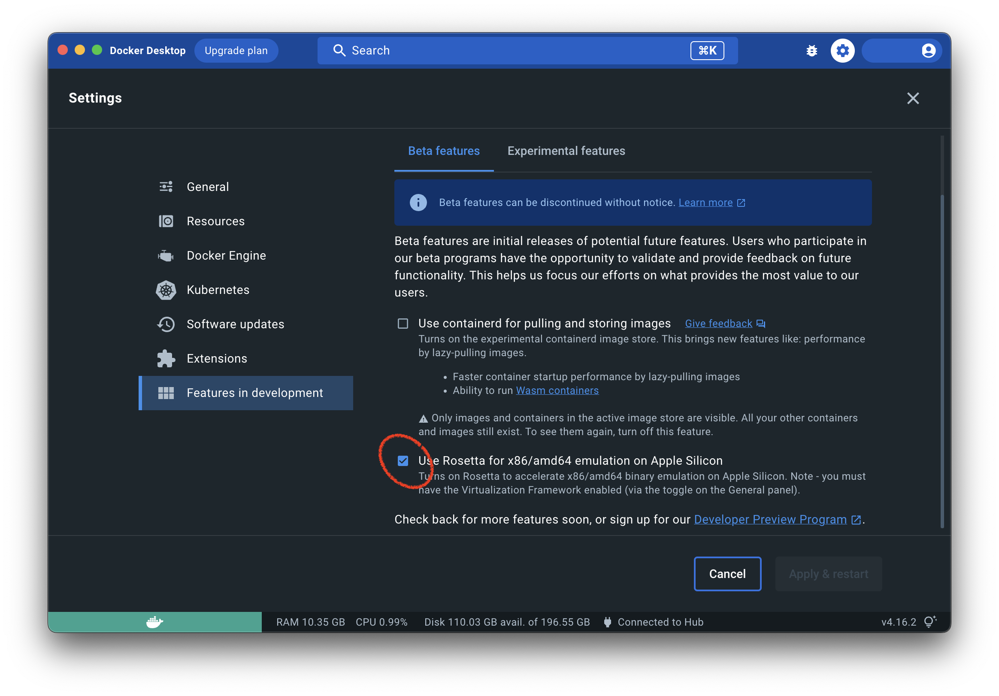

> Under Development. View Features section for completed work

# Introduction

This is a simple appointment booking api to demonstrate preferred patterns and architecture.

Users create an account with a default calendar and can add, remove, update or delete events to this calendar.
Users can only have 1 account but can have multiple calendars.

## Motivation
I want to have a starter template for building Dotnet Apis. Things that are important:
- Excellent developer experience
- Zero config setup for running integration tests locally against a datastore
- Established application architecture e.g. Vertical Slices or Clean Architecture
- Contains examples for common problems e.g. Validation, Logging, Authentication, Data Access

## Features
- [x] Zero config integration testing against the database
- [ ] Zero config integration testing with events
- [ ] Zero config integration test with authentication
- [x] Architecture tests to enforce intended architecture i.e. Domain code cannot use code from Infrastructure
- [x] Vertical Slice Architecture
- [ ] Validation
- [ ] Use Repositorities to enforce write data access through Aggregate Roots
- [ ] Use Dapper or EF Core Raw SQL for read data access
- [ ] Logging
- [ ] Error Handling

## Technologies
- Testcontainers
- xUnit
- EF Core for writing to the datastore
- Dapper for reading from the datastore
- FluentValidation
- Serilog

## Patterns
- Vertical Slice
- CQRS
- REPR (Request Endpoint Response)
- Repository Pattern
- Feature Folders

## Prerequisites

- .NET 8 SDK
- The LATEST Docker
  for [Mac](https://docs.docker.com/desktop/install/mac-install/)/[Windows](https://docs.docker.com/desktop/install/windows-install/)

On Mac enable Rosetta in the beta features as shown in the image below:



## Running the Tests

- Run `dotnet test` from the root of the project

# Requirements

The requirements are written in the Given When Then format. This is a common format used
for acceptance criteria & tests. The requirements are written in a way that is not specific to any
particular technology. This allows us to write the tests first and then implement the
functionality to make the tests pass.

Writing Acceptance Tests will be out of the scope of this exercise. However, the requirements
can still guide our Integration & Unit Tests.

```
Given there is no account for user A
When user A creates an account
Then the account is persisted
And a calendar is created
```

```
Given there is an account for user A
When user A deletes their account
Then the account is not active
And the calendar is not active
```

```
Given there is an account for user A
And there is a calendar for user A
When a user creates an appointment in the calendar for user A
Then the appointment can be viewed
```

```
Given there is an account for user A
And there is a calendar for user A
When a user creates an appointment in the calendar for user A
Then the appointment can be viewed
```

```
Given there is an account for user A
And there is a calendar for user A
And there is an appointment Z
When a user updates appointment Z
Then the updated appointment is persisted
```

```
Given there is an account for user A
And there is a calendar for user A
And there is an appointment Z
When a user deletes appointment Z
Then appointment Z is not active
```

```
Given there is an account for user A
And there is a calendar for user A
And there is an appointment Z at 11am
When a user creates another appointment X at 11am
Then appointment X is also persisted
```

```
Given there is an account for user A
And there is a calendar for user A
And there is an appointment Z at 11am
And there is an appointment X at 11am
When a user gets all appointments
Then all appoints can be viewed
And the conflicting appointments can also be viewed
```

